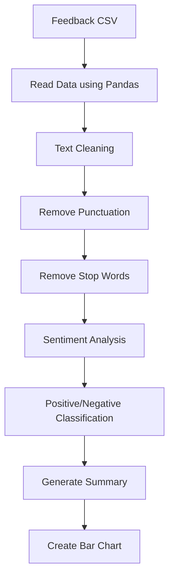

# project-1
**This  is my first AI & ML project**


 # 🧹 [AI] Text cleaner & Sentiment Tagger
 
## **📌 Project Overview**

AI Text Cleaner & sentiment tagger is a Natural language processing (NLP) project that cleans user feedback text and automatically identifies whether the sentiment is positive or nagative. the project helps organizers quickly understand audience opinions without manually reading every comment.

 ## **🎯 Problem Statement**

After events,worksshops,or community activities, feedback id often collected as free-text comments.Reading and analyzing hundreds of comments manually is time-consuming.this project automates the process by cleaning text and performing sentiment analysis to provide instant insights.
    this project automates the process by:
    * Cleaning text data
    * Removing unnecassary words and symbols
    * Identifying sentiment
    * Genereting summaries and visualizations

 ## **✨ Features**

  📂 Read feedback data from CSV files
  
  🧹 Convert text to lowercase
  
  🔍 Remove punctuation and special characters
  
  📝 Remove stop words
  
  🤖 Perform AI-based sentiment analysis
  
  📊 Generate sentiment statistics
  
  📈 Visualize positive and negative feedback
  
  ⚡ Fast and easy to use

  

 ## **🛠️ Technologies used**
 
   * Python
   * Pandas
   * NLP (Natural Languege Processing)
   * Hugging Face TRansformes
   * Matplotkib
   * CSV Data Processing

    
 
  ## **🔄 Project Workflow**
  Here is the simple flow chart:




## **📁 Project Structure**

```text
AI-Text-Cleaner-Sentiment-Tagger
│
├── data
│   └── feedback.csv
│
├── screenshots
│   └── output.png
│
├── main.py
├── requirements.txt
├── README.md
│
└── models
    └── sentiment_model
```

## **⚙️ Installation**

### clone the repository
```
git clone https://github.com/prasadnarendravarapu-oss/AI-Text-Cleaner-Sentiment-Tagger.git

 ```

### Navigate to the project directory
```
cd AI-Text-Cleaner-Sentiment-Tagger
```

### Install required Dependencies
```
pip install pandas transformers torch matplotlib
```

### verify Installation
```
pip list
```

### Run the project
```
python main.py
```

## **▶️ Run the Project**
```
python main.py
```
The prograam will:

   1.REAd feedback from csv.

   2.clean the text.

   3.Analyze sentiment.

   4.gererate a chart.

## **📥 Sample input**
```
feedback
The session was amazing and clear!
very useful workshop.
poor organization and timing.
I did not understand the topic.
```

## **📥 Sample output**
```
Positive Feedvback: 2
Negative Feedback: 2
```

## **📊Expected Visualization**

| Output Screenshot | |
|-------------------|-------------------------------|


## **🧠Learning Outcomes**
  Through this project,i learned:
  * NLP fundamentals
  * Text preprocessing
  * Stop-word removal
  * Sentiment analysis
  * Hugging Face Transformers
  * Data visualization
  * Python project development

## **🚀Feature Improvements**
   * Neural sentiment classification
   * Streamlit web application
   * Real-time feedback support
   * Multiple language support
   * Export reports as PDF
   * Interactive dashboard


## 👨‍💻 Author 
Durga Prasad Narendravarapu

B.Tech CSE(Data science) student

AI & Machine Learning Enthusiast

GutHub:https://github.com/prasadnarendravarapu-oss

linkedin:https://www.linkedin.com/in/narendravarapu-durga-prasad-32811b326?utm_source=share_via&utm_content=profile&utm_medium=member_android


